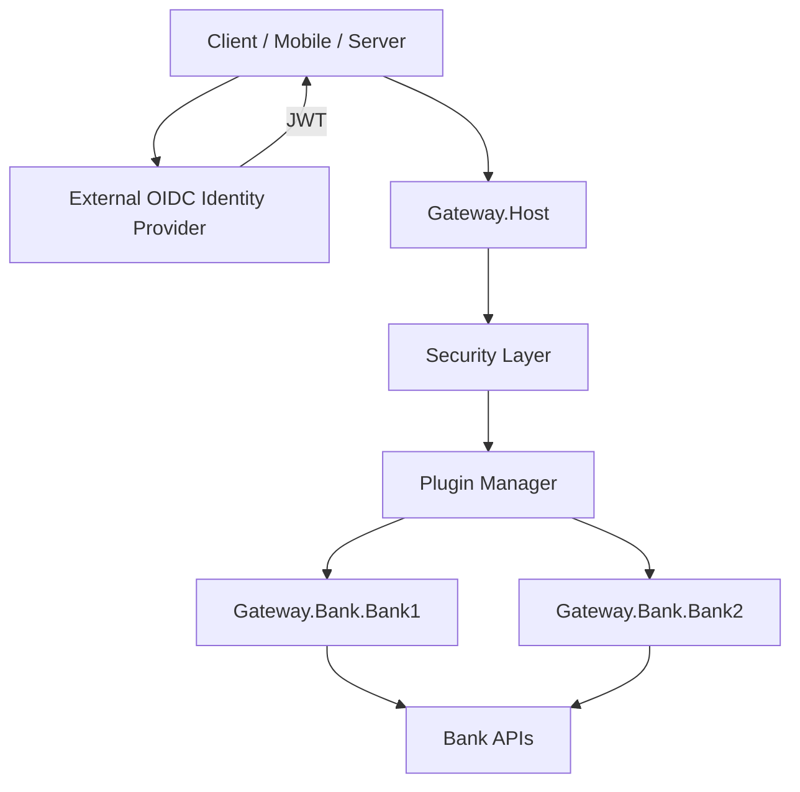

# Banking Gateway Architecture

## Overview

The Banking Gateway is a **stateless** .NET 8 API gateway that validates JWTs from an external OIDC provider, applies security controls, and routes traffic to downstream banking services through **bank plugins**.



## Dependency Direction

```
Gateway.Host
    ↓
Gateway.Bank.* (plugins)
    ↓
Gateway.Framework.Plugins
    ↓
Gateway.Framework.* (Core, Security, Logging, Gateway, …)
```

**Critical rule:** The framework never references bank-specific projects. Banks depend on the framework; the host references enabled bank plugins at compile time.

## Framework Modules

| Module | Responsibility |
|---|---|
| `Gateway.Framework.Core` | Domain abstractions, errors, API responses, idempotency constants |
| `Gateway.Framework.Shared` | DI helpers, HTTP extensions, JSON defaults |
| `Gateway.Framework.Infrastructure` | Configuration options (no dead cache/encryption DI) |
| `Gateway.Framework.Security` | JWT validation, authorization, secure headers, IP allow-list |
| `Gateway.Framework.Logging` | Serilog, audit logging, sensitive data masking |
| `Gateway.Framework.Monitoring` | Health checks, OpenTelemetry |
| `Gateway.Framework.Resilience` | Banking-safe HttpClient retry/circuit breaker |
| `Gateway.Framework.Gateway` | YARP, middleware, rate limiting, API versioning |
| `Gateway.Framework.Plugins` | Plugin contract, manager, YARP route merge |

## Authentication

**IMPLEMENTED — JWT/OIDC validation only**

The gateway does **not** issue tokens. An external Identity Provider is **REQUIRED EXTERNAL SERVICE**.

## Plugin Architecture

**IMPLEMENTED**

- `IBankingGatewayPlugin` — stable bank integration contract
- `IBankingGatewayPluginManager` — registration, validation, lifecycle, status
- `BankingPluginCapability` — declared capabilities per bank
- YARP routes/clusters contributed via declarative `PluginRouteBuilder` (not raw YARP config)
- Plugin health checks tagged `plugin` + `ready`
- Correlation ID propagation via `AddBankPluginHttpClient`

## Idempotency

**DELEGATED TO DOWNSTREAM SERVICE**

The gateway propagates `Idempotency-Key` headers. It does not maintain an idempotency store.

## Resilience

- Safe HTTP methods (GET/HEAD/OPTIONS/TRACE) may retry
- Financial POST operations are **not** blindly retried
- Payment plugin routes use financial resilience metadata

## Observability

- OpenTelemetry ASP.NET Core + HttpClient instrumentation
- Structured Serilog logging with masking
- Audit events for auth, rate limits, IP rejection, plugin init failures

## Production Fail-Fast

Production startup fails when:

- Auth disabled or missing Authority/Audience
- Development anonymous bypass enabled
- Localhost downstream URLs (static YARP or enabled plugins)
- Enabled plugin missing BaseUrl

## Stateless Design

No authentication database. No token issuance. No gateway idempotency store unless explicitly added with a documented correctness model.
