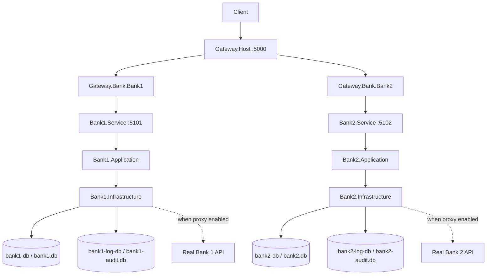

# Bank Service Development Guide

This guide describes how **Bank1.Service** and **Bank2.Service** are structured as independent Clean Architecture bounded contexts within the GateWay Framework solution.

---

## Overview

Each bank service is a **separately deployable** ASP.NET Core application with its own:

- Domain, Application, Contracts, Infrastructure, and API layers
- Business database and audit database
- EF Core migrations
- Swagger, health checks, and configuration
- Unit and integration tests

Bank services integrate with the gateway through **HTTP only**. They do **not** share databases or domain models.



---

## Project Structure

### Bank1

| Project | Purpose |
|---|---|
| `services/Bank1.Service` | API host (controllers, middleware, Swagger, DI composition) |
| `services/Bank1.Service.Application` | Feature handlers, validators, abstractions |
| `services/Bank1.Service.Domain` | Entities, value objects, rules |
| `services/Bank1.Service.Contracts` | Stable API DTOs |
| `services/Bank1.Service.Infrastructure` | EF Core, repositories, banking proxy, audit, health checks |
| `services/Bank1.Service.Tests` | Unit + integration + architecture tests |

### Bank2

Same layout under `services/Bank2.Service.*`.

### Shared (technical only)

| Project | Purpose |
|---|---|
| `services/Shared/Banking.Service.Audit.Abstractions` | Generic `AuditEntry` + `IAuditWriter` — no bank business logic |

---

## Dependency Direction

```
API → Application → Domain
Infrastructure → Application → Domain
Contracts → (no infrastructure)
```

**Rules enforced by tests:**

- Domain does not reference EF Core, ASP.NET Core, or Infrastructure
- Application does not reference Infrastructure or API
- Bank1 does not reference Bank2 (and vice versa)
- Gateway.Framework.* does not reference bank services

---

## Feature Flow (Example)

`GET /api/accounts` on Bank1:

```
AccountsController
  → GetAccountsHandler (Application)
    → IAccountRepository (Application abstraction)
      → AccountRepository (Infrastructure)
        → Bank1DbContext → bank1.db
```

`GET /api/payments` on Bank2 follows the same pattern through `GetPaymentsHandler`.

---

## Databases

Each service owns **two** databases:

| Service | Business DB (dev SQLite) | Audit DB (dev SQLite) | Docker PostgreSQL |
|---|---|---|---|
| Bank1 | `bank1.db` | `bank1-audit.db` | `bank1-db`, `bank1-log-db` |
| Bank2 | `bank2.db` | `bank2-audit.db` | `bank2-db`, `bank2-log-db` |

**Never** point Bank1 at Bank2 databases or share a DbContext across banks.

Configuration (`appsettings.json`):

```json
"Database": {
  "Provider": "Sqlite",
  "ConnectionString": "Data Source=bank1.db"
},
"AuditDatabase": {
  "Provider": "Sqlite",
  "ConnectionString": "Data Source=bank1-audit.db"
}
```

For Docker/PostgreSQL, set `Database:Provider` and `AuditDatabase:Provider` to `Npgsql` and use the compose connection strings.

---

## Migrations

Migrations live under each service's Infrastructure project:

- Business: `Persistence/Migrations/`
- Audit: `Persistence/AuditMigrations/` (separate history table: `__Bank1AuditMigrationsHistory`, `__Bank2AuditMigrationsHistory`)

**Bank1:**

```bash
dotnet ef migrations add InitialCreate \
  --project services/Bank1.Service.Infrastructure/Bank1.Service.Infrastructure.csproj \
  --startup-project services/Bank1.Service/Bank1.Service.csproj \
  --output-dir Persistence/Migrations \
  --context Bank1DbContext

dotnet ef database update \
  --project services/Bank1.Service.Infrastructure/Bank1.Service.Infrastructure.csproj \
  --startup-project services/Bank1.Service/Bank1.Service.csproj \
  --context Bank1DbContext
```

**Bank2:** replace `Bank1` with `Bank2` and use `Bank2DbContext` / `Bank2AuditDbContext` for audit migrations.

On startup, `DatabaseInitializer` applies migrations and seeds sample data.

---

## Logging & Audit

| Type | Destination |
|---|---|
| Application logs | Console / structured logging (ILogger) |
| Audit events | Dedicated audit DB via `IAuditWriter` |

Audit records include: timestamp, correlation ID, service name, operation, resource, success/failure. Sensitive data (tokens, credentials) is **not** stored.

---

## Banking Proxy

Application depends on abstractions (`IBank1Client`, `IBank2Client`). Infrastructure implements `Bank1BankingProxy` / `Bank2BankingProxy`.

| Mode | Behavior |
|---|---|
| `Bank1Proxy:Enabled=false` (default dev) | Reads/writes local database |
| `Bank1Proxy:Enabled=true` | HTTP client to real bank API — **REQUIRES REAL BANK INTEGRATION** |

Resilience policies (timeout, circuit breaker) apply only when the proxy is enabled. POST payment/transfer operations are **not** blindly retried; idempotency keys protect Bank2 write operations.

---

## Service-to-Service Communication

Bank1 and Bank2 **do not** communicate directly. If cross-bank data is needed in production, expose an explicit HTTP API contract — never access another bank's database.

---

## Authentication

| Layer | Current behavior | Production recommendation |
|---|---|---|
| Gateway | JWT/OIDC validation | Keep as primary trust boundary |
| Bank services | No JWT validation in demo | Add service identity (mTLS or OAuth2 client credentials) for defense-in-depth |

---

## Health Checks

| Endpoint | Purpose |
|---|---|
| `/health/live` | Process alive (`self` check) |
| `/health/ready` | Business DB + audit DB ready |

---

## Swagger

| Service | URL |
|---|---|
| Bank1 | http://localhost:5101/swagger |
| Bank2 | http://localhost:5102/swagger |

Gateway does not expose merged bank Swagger.

---

## Local Development

**Three terminals:**

```bash
dotnet run --project services/Bank1.Service/Bank1.Service.csproj
dotnet run --project services/Bank2.Service/Bank2.Service.csproj
dotnet run --project Gateway.Host/Gateway.Host.csproj
```

**Verify:**

```bash
curl http://localhost:5101/api/accounts
curl http://localhost:5102/api/payments
curl http://localhost:5000/api/v1/banks/bank1/accounts
curl http://localhost:5000/api/v1/banks/bank2/payments
```

**Docker (PostgreSQL):**

```bash
docker compose up --build
```

---

## Testing

```bash
dotnet test GateWayFrameWork.sln
```

| Project | Coverage |
|---|---|
| `Bank1.Service.Tests` | Handlers, architecture, DB isolation, API integration |
| `Bank2.Service.Tests` | Payments, idempotency, architecture, DB isolation, API integration |
| `Gateway.Tests.Integration` | Gateway → bank E2E, plugins, auth |

Tests use isolated SQLite files per test host to avoid migration conflicts.

---

## Adding a New Feature (Bank1 Example)

1. Add domain rules/entities in `Bank1.Service.Domain` if needed
2. Add DTOs in `Bank1.Service.Contracts`
3. Add handler + validator in `Bank1.Service.Application/Features/...`
4. Register handler in `ApplicationServiceCollectionExtensions`
5. Implement repository methods in Infrastructure if persistence is needed
6. Add thin controller action in `Bank1.Service`
7. Add unit/integration tests

Repeat independently for Bank2 with Bank2-specific concepts.

---

## Related Documentation

- [architecture.md](architecture.md) — gateway + bank topology
- [plugin-development.md](plugin-development.md) — YARP plugin integration
